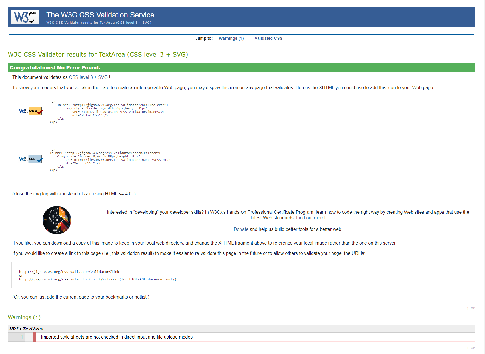

# Freshwater-Fly-Fishing

## Introduction
- Site Owner's goal: Freshwater Fly Fishing is a site that aims to help introduce people to the Sport of Fly Fishing in Ireland
- The website will be targeted towards people new to the Sport, and towards existing anglers who want to try a different style to traditional rod/reel-based fishing
- External User's goal: The site will be useful for users to understand some of the attractions of Fly Fishing, and get informed about locations where they can participate in the Sport

## Features

### Navigation Bar
- The Navigation bar is featured on all four pages of the site, and is identical on each page for consistency and  ease of navigation . 
- It is fully responsive, and includes links to the Home page, Locations, Gallery, and Contact pages
- This section will allow the site user to navigate quickly and easily from page to page across all device form-factors without having to use the “back” button to revert to previous pages

### Home Page Image
- The home page includes a photograph with Text overlay to welcome the user to the site upon first arrival
- This section welcomes the user with an eye-catching animation to grab their attention

### "About Us" Section
- The About us section will display for the user a selection of the reasons people wish to participate in the Sport of Fly Fishing
- The User will see some of the benefits of Fly Fishing and this should help encourage the user to participate in the sport

### Locations Page
- The Locations Page will contain details of the locations where people can participate in the Sport of Fly Fishing across Ireland
- The User will see a visual map and a key of the venues according to their nature – rivers and lakes.
- This should help inform the user about where they can go to practise the skills and learn how to Fly Fish

- (*Placeholder for IMAGE screenshot of locations page*)

### Footer
- The footer section includes links to the relevant social media sites for Freshwater Fly Fishing. The links will open to a new tab to allow easy navigation for the user.
- The footer is valuable to the user as it encourages them to keep connected via social media

### Gallery
- The gallery will provide the user with supporting images to see some examples of Fly Fishing in action.
- This section is valuable to the user as they will be able to easily internalise visually the experience of participating in the sport 

### Contact Page
 - This page will allow the user to contact Freshwater Fly Fishing with any queries they may have in relation to the Sport. The user will be asked to submit their full name and address, and will be allowed a free-form text box in which they can detail their question (1000 character limit)

 ### Features Left to implement
 - Instructional videos on techniques & skills
    - Line Casting 
    - Fly Tying
- User-submitted photos (e.g. locations & catches)
- Instructional & recipies for cooking your fish
- Expanding site contents to include Saltwater Fly Fishing 

## Testing
- I completed testing of the website pages in multiple broswers: Chrome, Firefox, Edge, and Safari
- I also used DevTools to confirm that the project is responsive, functional and aesthetically pleasing on all standard screen sizes 
- I confirmed that the navigation, header, about section, and contact pages are all readable & easy to understand
- Testing has also been completed to confirm that the contact form works correctly, that required fields are specified, and that the email field will only accept an email - and also that the submit button works

### HTML
- The W3C Validator was used to confirm that all HTML code was error free & functioned as expected

### CSS
- The CSS Ji3saw Validator was used to confirm that the CSS code was error free & functioned as expected

### Accessibility
- Lighthouse was used to audit the accesibility of the site via DevTools, confirming that the site was accesible & would be easy to use for all audiences

### Resolved Bugs
- Initially there were unexplained hypens present between my social media linksin my footer - i discovered this was due to spaces being present in my <a> tags in the footer from skipping lines & this was resolved
- The Text overlay on the Home Page Main Image was not travelling correctly with responsive screen sizes - this was due to a missing absolute position attribute in the CSS code and was resolved by adding the required attribute

### Unresolved Bugs
- No unfixed bugs were present in the finalised website code

## Deployment
- The site was deployed to Github pages. The steps to display are as follows:
    - In the GitHub repository, navigate to the settings tab
    - From the source section drop-down menu, select the master branch
    - The link will then be provided to the completed website

The live link can be found here: [Freshwater Fly Fishing](https://dkelly255.github.io/freshwater-fly-fishing/)

## Credits

### Content
- The code to make the social media links for the footer was initially taken from the Code Institute [Love Running](https://github.com/dkelly255/love-running) project, and was updated to fit the look & feel of Freshwater Fly Fishing

### Media
- The images in the Site were taken from [Pexels](https://www.pexels.com/search/fishing/)
- The site fonts were taken from [Google Fonts](https://fonts.google.com/)
- Icons used throughout the site were sourced from [FontAwesome](https://fontawesome.com/)