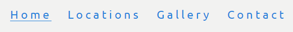
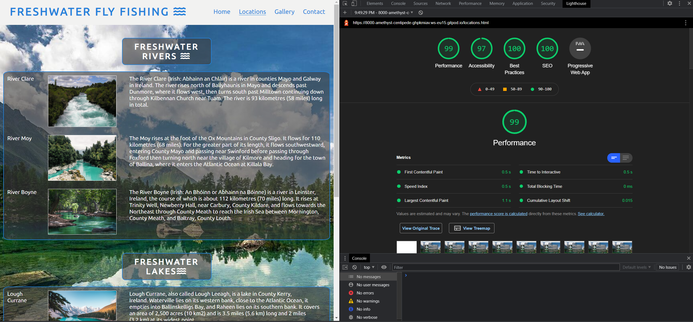

# Freshwater-Fly-Fishing

## Introduction
### Concept
- Freshwater Fly Fishing is a site that aims to help introduce people to the Sport of Fly Fishing in Ireland - this is the Site Owner's Goal
- The site will be useful for users to understand some of the attractions of Fly Fishing, and get informed about locations where they can participate in the Sport 
- The website will be targeted towards people new to the Sport, and towards existing anglers who want to try a different style to traditional rod/reel-based fishing - this is the External User's goal

### User Stories
- As a user of the site I would like to be able to:
    - Learn about why Fly Fishing can be an enjoyable experience
    - Identify some of the locations where Fly Fishing can be practised in Ireland
    - See pictures to understand Fly Fishing, the equipment and the environment in which it can be practised
    - Contact the Freshwater Fly Fishing website owners to ask any questions or queries related to the sport in Ireland

### Wireframes
- I prepared some simple wireframes using Microsoft Powerpoint to design a skeleton of how the site would look, and also to keep the project focused and on track during the process of coding the website, and to help identify & avoid scope creep where possible

#### Home Page & Nav Bar Original Concepts:

#### Locations Page Original Concept:

#### Gallery Original Concept:

#### Contact Page Original Concept:

## Table of Contents

- ### [Introduction](https://github.com/dkelly255/freshwater-fly-fishing#introduction)
    
    - #### [Concept](https://github.com/dkelly255/freshwater-fly-fishing#concept)
    
    - #### [User Stories](https://github.com/dkelly255/freshwater-fly-fishing#user-stories)

    - #### [Wireframes](https://github.com/dkelly255/freshwater-fly-fishing#wireframes)

- ### [Features](https://github.com/dkelly255/freshwater-fly-fishing#features-1)

    - #### [Navigation Bar](https://github.com/dkelly255/freshwater-fly-fishing#navigation-bar-1)

    - #### [Home Page](https://github.com/dkelly255/freshwater-fly-fishing#home-page-image)

    - #### [About Section](https://github.com/dkelly255/freshwater-fly-fishing#about-us-section)

    - #### [Locations](https://github.com/dkelly255/freshwater-fly-fishing#locations-page)

    - #### [Footer](https://github.com/dkelly255/freshwater-fly-fishing#footer-1)

    - #### [Gallery](https://github.com/dkelly255/freshwater-fly-fishing#gallery-1)

    - #### [Contact Page](https://github.com/dkelly255/freshwater-fly-fishing#contact-page-1)

    - #### [Features Yet To Implement](https://github.com/dkelly255/freshwater-fly-fishing#features-left-to-implement)

- ### [Testing](https://github.com/dkelly255/freshwater-fly-fishing#testing-1)

    - #### [Generic Testing](https://github.com/dkelly255/freshwater-fly-fishing#generic-testing)

    - #### [HTML Validation](https://github.com/dkelly255/freshwater-fly-fishing#html)

    - #### [CSS Validation](https://github.com/dkelly255/freshwater-fly-fishing#css)

    - #### [Accessibility](https://github.com/dkelly255/freshwater-fly-fishing#accessibility-1)

    - #### [Bugs (Resolved)](https://github.com/dkelly255/freshwater-fly-fishing#resolved-bugs)

    - #### [Bugs (Unresolved)](https://github.com/dkelly255/freshwater-fly-fishing#unresolved-bugs)

- ### [Deployment](https://github.com/dkelly255/freshwater-fly-fishing#deployment-1)

- ### [Credits](https://github.com/dkelly255/freshwater-fly-fishing#credits-1)

    - #### [Content](https://github.com/dkelly255/freshwater-fly-fishing#content-1)

    - #### [Media](https://github.com/dkelly255/freshwater-fly-fishing#media-1)

## Features

### Navigation Bar
- The Navigation bar is featured on all four pages of the site, and is identical on each page for consistency and  ease of navigation . 
- It is fully responsive, and includes links to the Home page, Locations, Gallery, and Contact pages
- This section will allow the site user to navigate quickly and easily from page to page across all device form-factors without having to use the “back” button to revert to previous pages

### Home Page Image
- The home page includes a photograph with Text overlay to welcome the user to the site upon first arrival
- This section welcomes the user with an eye-catching animation to grab their attention

### "About Us" Section
- The About us section will display for the user a selection of the reasons people wish to participate in the Sport of Fly Fishing
- The User will see some of the benefits of Fly Fishing and this should help encourage the user to participate in the sport

### Locations Page
- The Locations Page will contain details of the locations where people can participate in the Sport of Fly Fishing across Ireland
- The User will see a visual map and a key of the venues according to their nature – rivers and lakes.
- This should help inform the user about where they can go to practise the skills and learn how to Fly Fish

### Footer
- The footer section includes links to the relevant social media sites for Freshwater Fly Fishing. The links will open to a new tab to allow easy navigation for the user.
- The footer is valuable to the user as it encourages them to keep connected via social media

### Gallery
- The gallery will provide the user with supporting images to see some examples of Fly Fishing in action.
- This section is valuable to the user as they will be able to easily internalise visually the experience of participating in the sport 

### Contact Page
 - This page will allow the user to contact Freshwater Fly Fishing with any queries they may have in relation to the Sport. The user will be asked to submit their full name and address, and will be allowed a free-form text box in which they can detail their question (1000 character limit)

 ### Features Left to implement

There were several additional features that I would love to be able to add to this site, however as a brand new developer, and as someone new to HTML & CSS I found that I was constrained primarily by my own coding expertise combined with the time limits in place for the first milestone project submission deadline.

However, I am working hard on a daily basis to develop my HTML & CSS capability and I am confident this will soon allow me to be able to develop features such as the below and more:

 - Equipment page:
    - This would be an additional dedicated section of the website to cover the equipment used in the sport, for example:
        - Rods: Sizes, guages, selection depending on user attributes, venue, target species
        - Reels: types of reels, when to use, why use each type
        - Lines: Floating vs sinking, when to use, key considerations, visibility 
        - Flies: Wet, Dry, Lure, Stream, etc - when to use, why to use
    - For each category of equipment, things to cover would include when to use, why to use, how to select etc 
    - Additionally - it would then be possible to begin adding links to where to purchase the equipment, recommended suppliers, user reviews etc
    - It would also be possible to include descriptions, images, articles and videos around each category
 - Attire page: 
    - This would be an additional dedicated section of the website to cover the attire used to enable the sport comfortably, effectively, and safely for example:
        - Overview of clothing & attire used - Waders, Jackets, Hats, Footwear, Vests, Polarising Glasses
        - When to use, how to select, and where to purchase
        - Including descriptions, images, articles and videos around each category
 - Skills page:
    - This would be an additional dedicated section of the website to cover an overview of the unique techniques & skills of Fly Fishing, for example:
        - Casting Techniques - how to learn, how to practice safely, links to instructional videos and teachers/lessons
        - Fly Tying - how to get started creating your own flies, links to videos and lessons
        - Fish spotting - how to visually identify & track target fish, reading/estimating depths, understanding the flys in season for lure selection
- Catches page:
    - This would be a section of the website to cover the different species of fish that can be caught Fly Fishing in Ireland
        - Game Fish - Trout and associated sub-species (Brown/Rainbow/Sea), Salmon, Grayling
        - Coarse Fish - Pike, Carp, Perch
        - Sea Fish - Bass, Mackerel, Sunfish, Pollock
    - It would be possible to include pictures, videos descriptions and examples of the fish characteristics, typical sizes & weight, how to tailor approach for each, where they can be caught and during which seasons etc
- Freshwater Forum
    - Community/Discussion board where people can sign up to discuss & share experiences, photos, and questions around all aspects of the sport 
    - Including everything from locations, techniques, catches, successes, failures and all other relevant areas
    - To function as a dedicated specialist social network orientated around the sport of Fly Fishing
- Expanding site contents/developing a sister-site focused on the promotion of Saltwater Fly Fishing 
    - Fly fishing is currently primarily practiced in Freshwater in Ireland. The equipment design has been established around the generally smaller size and weight of fish in Freshwater relative to those found in saltwater
    - However recreational saltwater flyfishing is an area that has potential for growth in future - there are many species of saltwater fish that can also be in scope for flyfishing, and this can be a greatly expanding market with huge potential in future years

## Testing
### Generic Testing
- I completed testing of the website pages in multiple broswers: Chrome, Firefox, Edge, and Safari, and also used DevTools to confirm that the project is responsive, functional and aesthetically pleasing on all standard screen sizes
- Additionally I tested the site on different devices, operating systems and form factors - Desktop & Laptop (Windows) Ipad Tablet (IOS), and Galaxy Note 10 Phone (Android)
- I confirmed that the navigation, header, about section, and contact pages are all readable, scale as intended & are easy to understand
- Testing has also been completed to confirm that the contact form works correctly, that required fields are specified, and that the email field will only accept an email - and also that the submit button works

### HTML
- The W3C Validator was used to confirm that all HTML code was error free & functioned as expected

#### Home Page HTML Validation:

#### Locations Page HTML Validation:

#### Gallery Page HTML Validation:
- One warning was received regarding the Gallery page - however I decided to continue without adding another heading to the section however, as the user can clearly see they are on the Gallery page from the navigation bar highlight for the selected page and I felt the text would detract from the User Experience by breaking the pictorial flow of the gallery page

#### Contact Page HTML Validation:

### CSS
- The CSS Jigsaw Validator was used to confirm that the CSS code was error free & functioned as expected.
- As my CSS Code was contained in a single stylesheet (style.css) - I was able to validate the full website's styling via one direct input
- One generic warning was present in relation to importing stylesheets which was not relevant for my validation

### Accessibility
- Generically I used the DevTools suite, and Lighthouse to audit the site's accessibility and found the site had several accessiblity deficiencies in the early stages of development. 
- The most common issues were, firstly missing alt texts on the images on the gallery/locations pages, which I corrected by ensuring all images throughout the site had meaningful alt text descriptions... and secondly, inappropriately large image file sizes, which I was able to correct by redownloading images from source websites in smaller sizes, and then running the smaller baseline images through compression software at TinyPNG.com

#### Home Page Lighthouse Scores:

#### Locations Page Lighthouse Scores:

#### Gallery Page Lighthouse (Initial Scores):
- Initially I found the gallery page had very low performance scores on Lighthouse - I was able to resolve this by using smaller renders of the same images to improve the score

#### Gallery Page Lighthouse (Updated Scores):
- The updated accessibility score is shown below with a much improved performance metric following my changes above

#### Contact Page Lighthouse Scores:

### Resolved Bugs
- Initially there were unexplained hyphens present between my social media links in my footer - this was due to spaces being present in my anchor element tags in the footer which I resolved
- The Text overlay on the Home Page Main Image was not travelling correctly with responsive screen sizes - this was due to a missing absolute position attribute in the CSS code and was resolved by adding the required attribute

### Unresolved Bugs
- No unfixed bugs were present in the finalised website code

## Deployment
- The site was deployed to Github pages. The steps to display are as follows:
    - In the GitHub repository, navigate to the settings tab
    - From the source section drop-down menu, select the master branch
    - The link will then be provided to the completed website

The live link can be found here: [Freshwater Fly Fishing](https://dkelly255.github.io/freshwater-fly-fishing/)

## Credits

- There were several sources from which I dervied content, ideas, images and code to help build the site. 
- As a new developer this was my first HTML/CSS project - and I found the Code Institute's instructional videos and lessons on HTML/CSS and the [Love Running](https://github.com/dkelly255/love-running) training project to be particularly beneficial - I would not have been able to prepare this project without these sources

### Content

- I used the lessons learned during the Code Institute [Love Running](https://github.com/dkelly255/love-running) project to help with the structure for Freshwater Fishing
- In all applicable locations throughout the HTML & CSS codes I have included credits in the comments where code from other sources such as [Love Running](https://github.com/dkelly255/love-running), or The Net Ninja has been used and adapted for this website and this can be browsed in detail in the HTML & CSS files
- For example - The code to make the social media links for the footer was initially taken from the Code Institute [Love Running](https://github.com/dkelly255/love-running) project, and was updated to fit the look & feel of Freshwater Fly Fishing
- The code for the responsive grid on the locations page was taken from The Net Ninja's CSS grid tutorial, and adapted to display two grids to contain rivers & lakes, images, and descriptions - this is also clearly labelled in the CSS & HTML comments

#### Locations Page

##### Images

  1. River Clare - [Photo](https://www.pexels.com/photo/nature-forest-waves-trees-2438/) from Pixabay (No attribution required) 
  2. River Moy - [Photo](https://www.pexels.com/photo/scenic-view-of-river-325807/?utm_content=attributionCopyText&utm_medium=referral&utm_source=pexels) by Dom Gould from Pexels 
  3. River Boyne - [Photo](https://www.pexels.com/photo/body-of-water-between-green-leaf-trees-709552/?utm_content=attributionCopyText&utm_medium=referral&utm_source=pexels) by Ian Turnell from Pexels 
  4. Lough Currane - [Photo](https://www.pexels.com/photo/beautiful-view-of-moraine-lake-2662116/?utm_content=attributionCopyText&utm_medium=referral&utm_source=pexels) by Jaime Reimer from Pexels 
  5. Lough Mask - [Photo](https://www.pexels.com/photo/landscape-photography-of-white-mountain-753325/?utm_content=attributionCopyText&utm_medium=referral&utm_source=pexels) by Julius Silver from Pexels 
  6. Lough Carra - [Photo](https://www.pexels.com/photo/scenic-view-of-lake-in-forest-247600/) from Pixabay (No attribution required)  

  ##### Descriptions

  1. River Clare - [Description](https://en.wikipedia.org/wiki/River_Clare) from Wikipedia, the Free Encylopedia 
  2. River Moy - [Description](https://en.wikipedia.org/wiki/River_Moy) from Wikipedia, the Free Encylopedia  
  3. River Boyne - [Description](https://en.wikipedia.org/wiki/River_Boyne) from Wikipedia, the Free Encylopedia  
  4. Lough Currane - [Description](https://en.wikipedia.org/wiki/Lough_Currane) from Wikipedia, the Free Encylopedia  
  5. Lough Mask - [Description](https://en.wikipedia.org/wiki/Lough_Mask) from Wikipedia, the Free Encylopedia  
  6. Lough Carra - [Description](https://en.wikipedia.org/wiki/Lough_Carra) from Wikipedia, the Free Encylopedia  
    
#### Gallery Page

##### Images

  1. gallery1 - [Photo](https://www.pexels.com/photo/wood-fishing-dawn-landscape-5738360/) by Austin Cooper from Pexels
  2. gallery2 - [Photo](https://www.pexels.com/photo/boy-catching-fish-with-fishing-rod-3099187/) by Maël Balland from Pexels
  3. gallery3 - [Photo](https://www.pexels.com/photo/man-in-gray-jacket-and-black-pants-sitting-on-brown-rock-in-the-river-4828253/) by cottonbro from Pexels
  4. gallery4 - [Photo](https://www.pexels.com/photo/iceland-fishing-sea-man-6739176/) by gaspar zaldo from Pexels
  5. gallery5 - [Photo](https://www.pexels.com/photo/woman-in-red-striped-shirt-and-blue-denim-shorts-holding-fishing-rod-1143921/) by Brett Sayles from Pexels
  6. gallery6 - [Photo](https://www.pexels.com/photo/fishing-light-sea-landscape-6738876/) by gaspar zaldo from Pexels 
  7. gallery7 - [Photo](https://www.pexels.com/photo/man-in-gray-jacket-holding-black-fishing-rod-6739261/) by gaspar zaldo from Pexels 
  8. gallery8 - [Photo](https://www.pexels.com/photo/black-and-brown-fishing-rod-beside-hook-and-brown-knife-3690705/) by Pablo Gutierrez from Pexels
  9. gallery9 - [Photo](https://www.pexels.com/photo/fishing-light-sea-landscape-8926362/) by Jamie Ross from Pexels
  10. gallery10 - [Photo](https://www.pexels.com/photo/landscape-photography-of-body-of-water-near-mountains-1192662/) by Oziel Gómez from Pexels
  11. gallery11 - [Photo](https://www.pexels.com/photo/man-in-brown-jacket-standing-on-river-6970952/)  by Kathryn Archibald from Pexels
  12. gallery12 - [Photo](https://www.pexels.com/photo/wood-fishing-landscape-water-6590545/) by Greg from Pexels

  ### Media
- The images in the Site were taken from [Pexels](https://www.pexels.com/search/fishing/) and [Pixabay](https://pixabay.com/)
- The site fonts were taken from [Google Fonts](https://fonts.google.com/)
- Icons used throughout the site were sourced from [FontAwesome](https://fontawesome.com/)
- All descriptions of Rivers & Lakes were sourced from wikipedia.com
